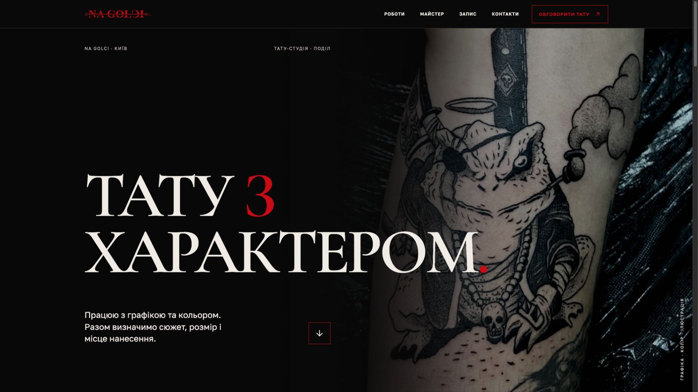
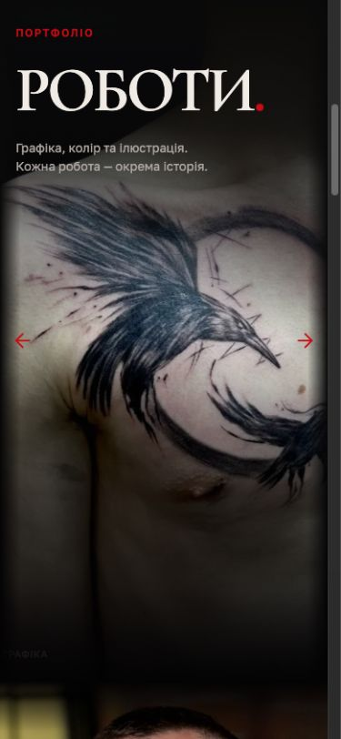
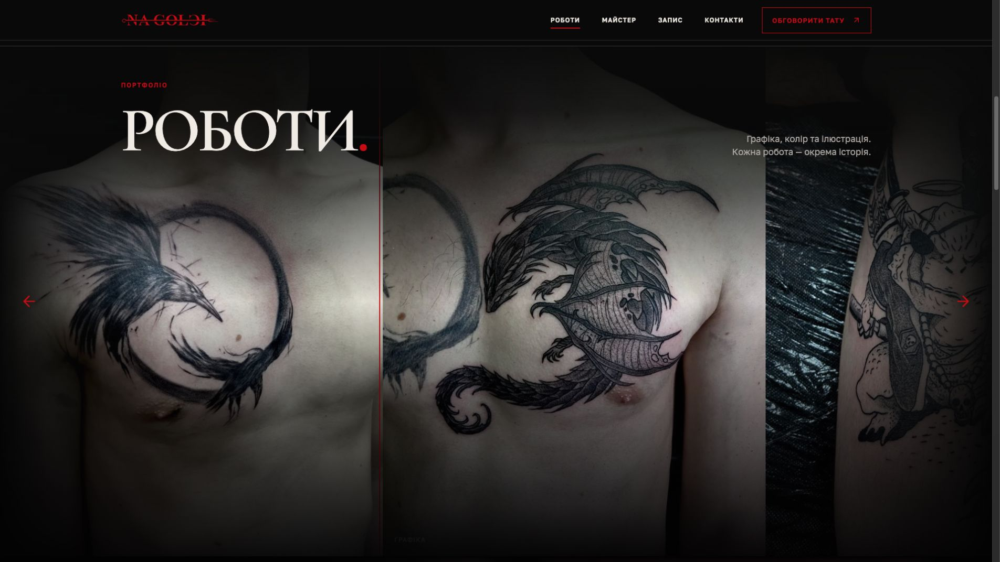
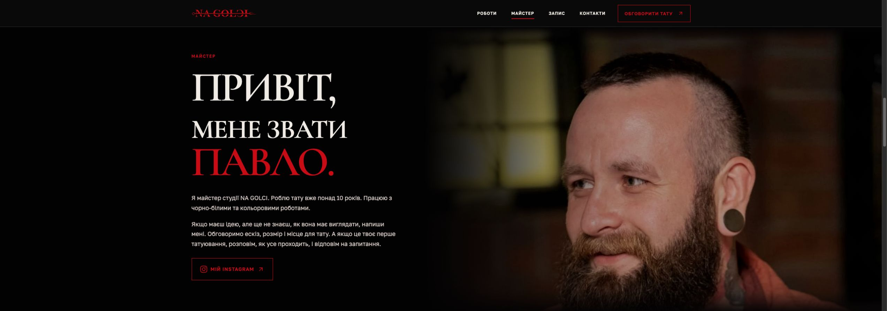
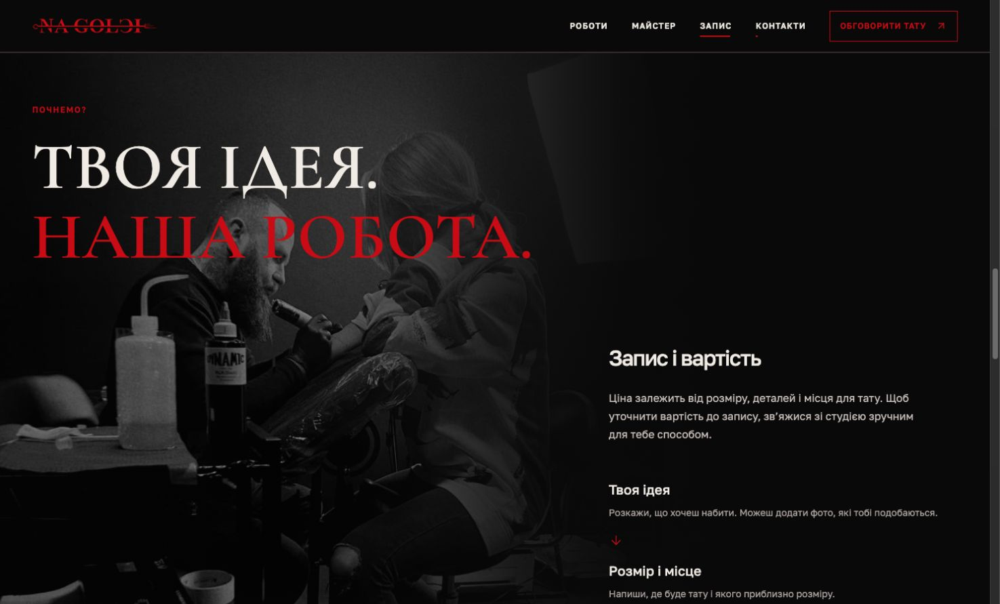
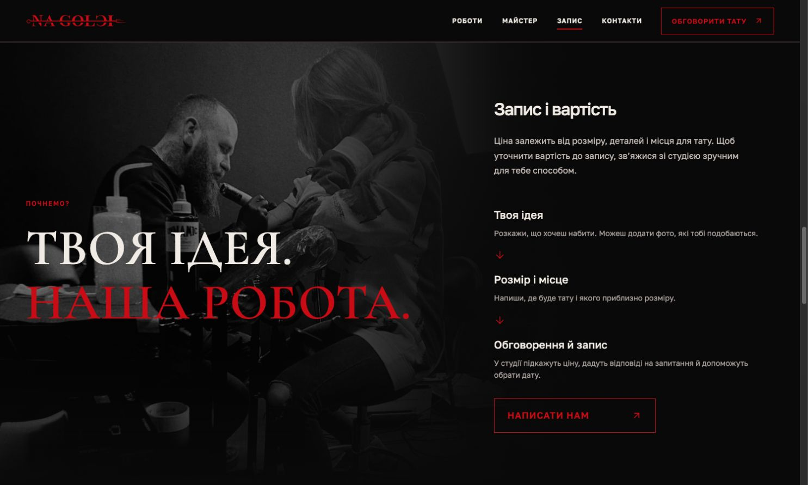
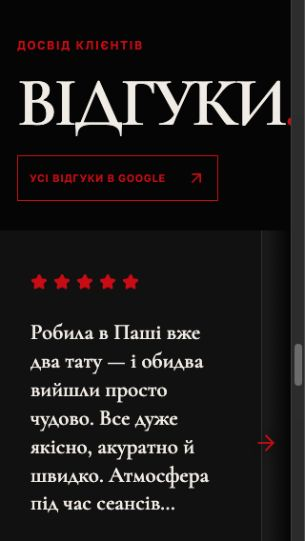
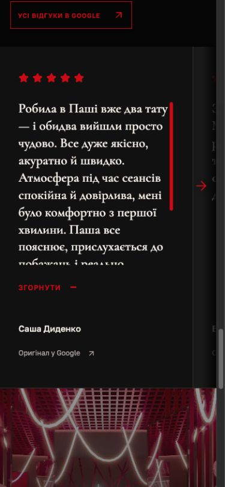

# NA GOLCI: визуальный и UI/UX аудит

**Дата:** 30 сентября 2026. **Версия:** локальный сайт `http://localhost:4318/`.

## Вывод

У сайта уже есть узнаваемый характер: оригинальный логотип, черный фон, глубокий красный, крупная антиква, настоящие работы и фотографии Павла. Лучше всего это сочетание работает на просторном десктопе. Сайт воспринимается как авторская тату-студия, а не каталог услуг с шаблонными карточками.

Следующий этап — согласовать адаптивную композицию, читаемость и путь к записи. Самая слабая зона сейчас — планшеты и экраны с большой шириной при небольшой высоте. Некоторые секции слишком зависят от ширины окна, другие — от его высоты; при их сочетании появляются неудачные кадрирования, пустоты и резкие изменения сетки.

Рекомендую сохранить визуальную основу. Логотип не менять; белые секции, бледно-красные заливки, декоративные номера секций и слэши не возвращать. Большие фотографии и плавные затухания оставить, но настроить отдельно для каждого сюжета и отделить их от слоев с текстом и контролами.

## Как проверялось

Просмотрены все основные секции на 13 базовых размерах окна и два переходных состояния сетки процесса. Проверялись начальное состояние, скролл, раскрытый отзыв, открытая фотография, перетаскивание, клавиатурная навигация и края каруселей. Визуальные наблюдения сопоставлены с размерами элементов и правилами CSS.

| Тип окна | Размеры, CSS px | Что проверялось особенно внимательно |
| --- | --- | --- |
| Узкие телефоны | 320×568, 360×640 | Длинные слова, минимальные высоты, размер подписей |
| Телефон | 390×844 | Первое впечатление, карусели, длинные отзывы, контакты |
| Граница мобильной сетки | 760×1024, 768×1024 | Резкая смена композиции |
| Портретный планшет | 820×1180 | Портрет, процесс, пересечение текста с фото |
| Горизонтальный планшет | 1024×768 | Плотность сетки, короткий экран |
| Ноутбук | 1366×768 | Чтение отзывов и доступность действий |
| Десктоп | 1440×900, 1920×1080 | Композиция, типографика, движение |
| Граница сетки процесса | 1490×900, 1500×900 | Скачок высоты и положения заголовка |
| Широкий экран | 2560×900 | Кадрирование при ограниченной высоте |
| Очень широкий экран | 3200×1080 | Ограничение фоновых фото и размер текста |
| Низкое горизонтальное окно | 844×390 | Поведение при небольшой высоте |

**Ограничения:** размеры задавались в настольном браузере. Это проверка адаптивной верстки, а не тест на физических телефонах и планшетах. Настоящие touch-жесты, pinch-to-zoom, VoiceOver, разные браузеры и производительность на слабом устройстве здесь не проверялись. Коммерческая эффективность предложений — гипотеза: аналитики и пользовательского тестирования нет.

Ниже разделены подтвержденные проблемы и дизайнерские предложения. Числа для будущих размеров — ориентиры для прототипа, а не готовые универсальные значения. Код сайта в ходе аудита не менялся.

## Приоритеты

**P1** — исправить в ближайшей итерации: мешает чтению, просмотру или адаптивной композиции. **P2** — заметное улучшение удобства и визуальной цельности. **P3** — дополнительная полировка.

| ID | Приоритет | Наблюдение | Где | Предлагаемое решение |
| --- | --- | --- | --- | --- |
| A1 | P1 | Процесс слишком рано получает десктопную сетку; заголовок перекрывает головы | 768–1440 px | Отдельная планшетная композиция, безопасная зона для лиц |
| A2 | P1 | Раскрытие отзыва на низком экране может уменьшить видимую область текста | 1366×768; также телефоны | Раскрывать по содержимому или открывать полноценный режим чтения |
| A3 | P1 | Заголовок отзывов обрезается | 320×568 | Размер по доступной ширине, без жесткого минимума 72 px |
| A4 | P1 | Портрет масштабируется слишком сильно на широких низких экранах | 2560×900 | Учитывать высоту и безопасную область головы и бороды |
| A5 | P1 | Подписи фото попадают под затемнение и почти не читаются | Десктоп, клавиатурный фокус | Поднять подписи над слоем fade out |
| A6 | P1 | Маленький красный текст на темном фоне имеет недостаточный контраст | Кнопки, лейблы, футер | Разделить декоративный красный и цвет мелкого функционального текста |
| A7 | P2 | На телефоне не видно, что за первой фотографией есть следующая | 320–390 px | Уменьшить мобильную высоту галереи с сохранением пропорций |
| A8 | P2 | Композиция процесса скачком меняется за 10 px ширины | 1490 → 1500 px | Плавная сетка и размер текста по ширине колонки |
| A9 | P2 | Мобильное меню полностью отсутствует | До 760 px | Компактная навигация по работам, мастеру, записи и контактам |
| A10 | P2 | Несколько секций подряд слишком длинные и одинаково монументальные | Мобильная страница | Развести имиджевые и практические секции по ритму |
| A11 | P2 | Автоматическое движение можно приостановить только временно | Галерея, бегущая строка | Постоянный пользовательский переключатель паузы |
| A12 | P2 | Отзывы не реагируют на нативный горизонтальный скролл | Trackpad / horizontal wheel | Согласовать способы управления двух каруселей |

## 1. Хедер

### Что работает

Логотип сохранен, ограничение ширины содержимого делает хедер собранным. Полоса снизу идет через все окно и хорошо отделяет навигацию от изображения. Подчеркивание активного пункта выглядит уместно и не перегружает меню дополнительными маркерами.

### Наблюдения

На 768 px все десктопное меню еще находится в одной строке. На 760 px оно полностью исчезает. Между этими состояниями нет компактной версии навигации. На телефоне остается кнопка обсуждения тату, но перехода к портфолио или записи без прокрутки нет.

Текст кнопки на телефоне очень мелкий: около 10 px, на самых узких экранах — 9 px. При этом сама область нажатия достаточно высокая, около 46 px. Проблема именно в распознавании надписи, а не в маленькой высоте кнопки.

Фиксация хедера включается при ширине от 761 px и высоте от 850 px. Такой порог имеет смысл для сохранения места на низких экранах, но адаптивные высоты секций и якорные смещения должны использовать фактическую высоту хедера.

### Предложения

- Добавить компактное меню на мобильных и узких планшетах. Достаточно четырех переходов и контакта; отдельная сложная панель не нужна.
- Переключать полную навигацию по тому, помещается ли она с комфортными промежутками, а не исключительно на 760 px.
- Сделать мобильный текст действия крупнее и спокойнее по насыщенности. Рассмотреть короткую надпись «Обговорити тату» без чрезмерного уменьшения.
- Сохранить активное подчеркивание после завершения прокрутки, как сейчас. В зоне отзывов активного пункта нет, поскольку этого пункта нет в меню; это согласуется с текущей структурой, а не является ошибкой индикатора.

**Приоритет:** P2; контраст надписей — P1.

## 2. Hero

### Что работает

На 1920×1080 композиция сильная: татуировка сразу показывает характер работ, текст пересекает фотографию, красные акценты связаны с логотипом. Настоящая работа хорошо выполняет роль первого визуального доказательства.

### Наблюдения

На телефоне главный заголовок становится значительно меньше следующих заголовков: около 47 px на 390 px ширины, тогда как заголовки ниже могут достигать 72 px. Основной смысл страницы визуально уступает второстепенным секциям.

На 320×568 и 360×640 минимальная высота hero около 710 px плюс хедер 66 px. Описание и нижнее действие не помещаются в первый экран. Само превышение высоты допустимо, но текущие большие фиксированные промежутки не помогают содержанию.

На горизонтальном окне 844×390 hero также остается высоким. Жестко пытаться уместить весь текст в 390 px не стоит; здесь лучше компактная версия композиции, которая растет по содержимому.

Внутри hero действие представлено стрелкой вниз. Она работает как навигация, но слабо объясняет, что пользователь увидит дальше.

### Предложения

- Задать отдельную мобильную иерархию: hero должен оставаться главным заголовком. Ориентир — 52–60 px с проверкой длины строк; соседние заголовки можно сделать компактнее.
- Уменьшать вертикальные промежутки на низких окнах, сохраняя комфортную высоту текста. Не скрывать описание ради строго одного экрана.
- Подписать действие «Дивитися роботи». Второй путь к обсуждению тату можно оставить в хедере, чтобы не создавать набор конкурирующих кнопок.
- Сохранить «Київ», «Поділ» и понятное обозначение тату-студии. Это полезная информация для человека; отдельную SEO-эффективность эта проверка не измеряет.

**Приоритет:** P2.

## 3. Бегущая строка

Черный фон и красный текст хорошо продолжают палитру сайта. Полоса уже достаточно выразительна; усиливать ее дополнительными эффектами не требуется.

Здесь появляется третий характер шрифта — узкий Oswald рядом с Cormorant и Golos. Это не ошибка, но добавляет еще один визуальный голос. Стоит сравнить версию с более спокойной высотой полосы и версию со шрифтом из основной системы.

В коде предусмотрено уменьшение движения через `prefers-reduced-motion`. Однако для постоянно движущегося декоративного содержания полезен и явный способ остановить движение. Временная остановка по наведению не заменяет постоянную паузу, о чем отдельно говорит [W3C: Pause, Stop, Hide](https://www.w3.org/WAI/WCAG22/Understanding/pause-stop-hide.html).

**Предложение:** небольшой доступный переключатель «Зупинити рух» для движущихся элементов. Состояние можно сохранять до конца просмотра страницы. На мобильном автоматическое движение галереи по-прежнему не включать.

**Приоритет:** P2 для управления движением, P3 для шрифта полосы.

## 4. Галерея работ

### Что работает

Это основной актив сайта. Фотографии большие, нет декоративных промежутков между ними, пропорции сохранены. Перетаскивание, стрелки и клавиатурная навигация работают. Обычный вертикальный скролл не превращается в горизонтальный. Автоматическое движение помогает заметить, что портфолио продолжается.

### Наблюдения

На 390 px ширины галерея имеет высоту примерно 778 px. Первая фотография получается шире экрана — около 589 px. Пользователь видит ее фрагмент, но не видит следующую работу. Похожая ситуация на узких телефонах: карусель неочевидна без попытки перетаскивания.

На большом десктопе верхнее и нижнее затухания занимают каждое примерно половину высоты галереи: около 490 px при высоте 980 px. Значительная часть татуировки оказывается затемненной, особенно тонкие детали внизу.

Подпись фотографии находится под общим слоем затемнения. Даже при клавиатурном фокусе текст категории почти исчезает. Это подтвержденная проблема порядка слоев, а не субъективное предпочтение цвета.

Начало портфолио преимущественно черно-белое, цветные работы появляются позже. Если цвет — важная часть специализации Павла, первый просмотр не полностью показывает диапазон.

### Предложения

- На телефоне уменьшить высоту галереи, сохранив естественные пропорции фото. Начальный ориентир — 400–460 px или около 55–65% высоты экрана. Проверять по реальным первым фотографиям, чтобы следующая была видна хотя бы на 10–15% ширины.
- Учитывать компромисс: высокая фотография с естественными пропорциями на узком экране не может одновременно целиком помещаться и оставлять место следующей. Предпочтительнее адаптировать высоту, чем незаметно обрезать сами работы.
- Оставить большой плавный fade out, но увеличить ясную область изображения. Затемнение под заголовком и по краям должно решать композиционную задачу, не перекрывая детали работы по всей высоте.
- Подписи и контролы поднять над слоем fade out. Дать им отдельную локальную защиту от пестрого фона, если она нужна.
- Показать сильную цветную работу среди первых трех-четырех фото. Порядок согласовать с Павлом по качеству и актуальности портфолио.
- Проверить, насколько категория вроде «Графіка» помогает просмотру. Короткое содержательное название из уже известных данных может быть полезнее, чем повтор одинаковой категории.

**Приоритет:** P1 для подписей, P2 для мобильной высоты, затуханий и порядка работ.

## 5. Открытая фотография

### Что работает

Просмотр не перегружен рамками или номерами. Фотография помещается с сохранением пропорций; стрелки и закрытие доступны. Проверены переход к следующему фото, Escape и возврат фокуса к исходной фотографии после закрытия.

Черные поля вокруг узкой фотографии на широком экране закономерны: полный просмотр без обрезки и заполнение всей ширины несовместимы при разных пропорциях.

### Предложения

- Сделать фон просмотра более непрозрачным и нейтральным: сейчас под ним слегка просматривается страница, что отвлекает от татуировки.
- Добавить свайп между работами на телефоне и увеличение для рассмотрения деталей. Эти жесты не проверялись на физическом устройстве; соответствующие обработчики в текущей реализации отсутствуют.
- Расположить подпись ближе к изображению, чтобы на широком экране она не выглядела оторванной от узкой фотографии.
- Сохранить заметный клавиатурный фокус. Красная рамка вокруг крестика в клавиатурном состоянии — индикатор фокуса; ее нельзя оценивать как случайную рамку окна.

**Приоритет:** P2 для мобильного просмотра, P3 для фона и подписи.

## 6. Мастер

### Что работает

Реальный портрет и представление от первого лица дают сайту личный характер. Текст уже разделен на два абзаца, лишний блок «10+» убран. Красное имя хорошо связывает заголовок с брендом.

### Наблюдения

Между 760 и 768 px происходит резкий переход от вертикальной версии к двум колонкам. На портретном планшете лицо и борода подходят близко к текстовой области; композиция требует отдельного положения изображения.

На 2560×900 ширина изображения около 1320 px при высоте области около 828 px. Исходный портрет имеет размер 1064×1331. При заполнении такой ширины его масштабированная высота получается около 1651 px, поэтому значительная часть кадра неизбежно уходит за пределы области. Настройка только вертикального положения переносит обрезку с волос на бороду и обратно.

На телефоне фотография занимает около 500 px, затем начинается отдельный большой текстовый блок. Общая высота секции на 390 px ширины — примерно 1174 px, на 320 px — около 1290 px. Такой размер допустим для имиджевой секции, но вместе с процессом создает длинную последовательность экранов до записи.

### Предложения

- Ограничивать масштаб портрета по сочетанию ширины и высоты, учитывая безопасную область от волос до конца бороды. Не компенсировать все проблемы одним `object-position`.
- На широких низких экранах умеренно уменьшать масштаб и приближать изображение к тексту, сохраняя плечо за правой границей. Не возвращать заметный пустой вертикальный отступ.
- Сохранить плавное верхнее и нижнее затухание, но не проводить его наиболее плотную часть через голову и бороду.
- Для планшетов определить отдельную композицию: либо более узкая зона изображения с защищенным лицом, либо переход к частично вертикальной подаче раньше текущего порога.
- На телефоне попробовать портрет высотой 350–440 px и более раннее начало представления. Это сравнение для следующего прототипа, а не обязательное уменьшение везде.
- Дополнить Instagram понятным переходом к записи. Человек, уже убедившийся в мастере, должен иметь путь к обсуждению идеи прямо здесь.
- Если есть оригинал портрета в большем разрешении, использовать его для крупных экранов. Личность и внешность на фотографии не изменять.

**Приоритет:** P1 для широких пропорций, P2 для планшетов и мобильного ритма.

## 7. Процесс / «Запис і вартість»

### Что работает

Фотография процесса подтверждает реальную работу мастера. Три шага понятны; стрелки между ними лучше отвечают текущему характеру страницы, чем номера. На просторном десктопе две колонки могут дать хорошую композицию.

### Подтвержденные проблемы

На 768 px ширины сохраняется сетка с правой колонкой до 520 px. Для второй области остается слишком мало места. Практический текст располагается поверх фотографии, а большой заголовок пересекает головы людей.

На 1440×900 секция имеет высоту около 1119 px. Заголовок располагается сверху, а блок записи начинается существенно ниже. Это образует большой пустой участок над практическим содержимым и усиливает ощущение случайного размещения текста.

При переходе 1490 → 1500 px высота меняется примерно с 1126 до 822 px, а заголовок перемещается в другую вертикальную композицию. Разница окна всего 10 px приводит к разнице секции около 304 px.

На 3200 px ширины заголовок достигает верхнего ограничения размера и переносит «НАША РОБОТА» на две строки, хотя на 1920 px эта строка помещается. Размер растет по ширине окна быстрее, чем доступная колонка.

На телефоне общий блок процесса составляет примерно 1357–1429 px. До кнопки после фотографии и шагов нужно пройти значительный участок страницы.

### Предложения

- Создать отдельную планшетную сетку. Практические шаги могут идти под фотографией и заголовком в одной колонке; для широкого десктопа сохранить две колонки.
- Выбирать размер заголовка по ширине его колонки, а не только по `vw`. Переносы должны быть устойчивыми при росте окна.
- Зафиксировать безопасную область для голов на фотографии. Положение текста, кадра и градиента проектировать вместе.
- В двухколоночной версии согласовать вертикальное выравнивание заголовка и блока записи. Пустоты над правой колонкой должны быть частью композиции, а не следствием нескольких независимых отступов.
- На телефоне сократить декоративную высоту фотографии; ориентир для сравнения — 440–520 px. Оставить шаги и кнопку близко друг к другу.
- Уточнить действие кнопки: «Написати нам» сейчас переводит к контактам, а не сразу открывает переписку. Можно либо назвать переход «Обговорити тату», либо дать прямой переход в выбранный канал связи и рядом альтернативы.
- Дополнить ответы на практические вопросы, только если Павло подтвердит данные: минимальная стоимость, как оценивается работа, подготовка, длительность, условия записи. Самостоятельно придумывать цены, предоплату и обещания не следует.

**Приоритет:** P1 для планшетной композиции, P2 для перехода сетки, длины мобильной секции и действия кнопки.

## 8. Отзывы

### Что работает

Реальные отзывы и ссылка на Google создают доказательство доверия. Нейтральные темные карточки подходят палитре. Перетаскивание свободное, без обязательной привязки к каждой карточке; стрелки исчезают на границах. Отдельного пустого отступа перед первой карточкой нет.

### Подтвержденные проблемы

На 320 px заголовок имеет жесткий минимум 72 px. Текст занимает около 292 px при доступной ширине около 269 px и обрезается справа.

Текст отзывов набран крупной антиквой, примерно 23–29 px. Для короткой цитаты это выразительно, но несколько полных абзацев превращаются в тяжелый набор с большим количеством строк.

Карточки могут достигать 900 px высоты. У коротких отзывов остается много пустого места до имени автора. Высота зависит от экрана больше, чем от объема текста.

Самая важная проблема — раскрытие. На 1366×768 раскрытый текст ограничивается примерно 168 px высоты. Свернутая версия в семь строк может показывать около 209 px. Нажатие «Читати повністю» в таком случае уменьшает видимую область и добавляет внутреннюю прокрутку.

На 390×844 длинный раскрытый отзыв также остается в области около 285 px при полной высоте текста около 418 px. Его приходится прокручивать внутри карточки.

Нативный горизонтальный скролл не сдвигает отзывы: в проверке положение до и после осталось одинаковым. Галерея такой ввод поддерживает. Пользователь получает разные способы управления похожими секциями.

Выделение текста отключено постоянно, а не только во время перетаскивания. Это предотвращает случайное выделение при drag, но также не позволяет скопировать фрагмент отзыва в обычном состоянии.

### Предложения

- Сделать размер заголовка отзывов действительно адаптивным к доступной ширине. Проверить слово и конечную точку на 320 px.
- Для полного текста попробовать Golos: 16–18 px на телефоне, 18–20 px на десктопе, межстрочный интервал примерно 1.45–1.6. Антикву оставить в заголовке; при желании использовать ее для короткой выделенной цитаты.
- Привести карточки к более компактной высоте. Ориентир — 480–640 px на десктопе; точное значение подобрать по текстам. Не создавать отдельную пустую полосу слева ради защиты карточки от fade out.
- Раскрытие должно увеличивать доступный текст. Предпочтительны рост карточки по содержимому или отдельный удобный режим чтения. Внутреннюю прокрутку на телефоне лучше исключить.
- Ограничивать выделение текста только в момент активного drag.
- Добавить обработку нативного горизонтального ввода, сохранив вертикальный скролл страницы.
- Не добавлять выдуманный общий рейтинг. Если нужен агрегат Google, он должен быть проверен отдельно; количество выбранных отзывов на сайте не равно количеству отзывов студии.

**Приоритет:** P1 для обрезанного заголовка и раскрытия; P2 для размера текста, высоты карточек и управления.

## 9. Контакты / «Чекаю тебе на Подолі»

### Что работает

Фотография студии, адрес, часы работы и узнаваемые иконки превращают имиджевую страницу в конкретное место. Заголовок дружелюбный, короткий и помещается лучше прежнего длинного слова. Светлый основной текст хорошо читается на темном фоне.

### Наблюдения

На телефоне сначала идет большая фотография, потом заголовок и информация, затем способы связи. Для человека, нажавшего «Обговорити тату» в хедере, нужное действие оказывается далеко внутри секции.

Кнопка карты визуально заметна раньше некоторых способов связи. Это полезно для визита, но основной сценарий записи начинается с обсуждения идеи.

Фотография, крупный заголовок и большие промежутки дают длинную финальную секцию. На телефоне она занимает примерно полторы высоты большого экрана. Обрезания содержимого в проверенных состояниях не обнаружено.

### Предложения

- Разместить один основной канал обсуждения рядом с заголовком и адресом, чтобы после перехода из хедера пользователь сразу мог действовать.
- Карту, часы и альтернативные контакты оставить ниже в ясном порядке. Приоритет канала согласовать с реальным способом работы студии.
- На телефоне сравнить более короткую фотографию, около 280–340 px, без потери атмосферного входа в секцию.
- Сократить чрезмерные промежутки между заголовком и контактными действиями.
- Проверить смысл внешней стрелки: у Instagram и карты она понятна; телефон и почта запускают звонок или письмо, для них уже есть соответствующие иконки. Это небольшая возможность сделать действия точнее.
- Не возвращать отдельную пустую секцию «Про студію»: текущая фотография и реальные контакты уже выполняют ее полезную часть.

**Приоритет:** P2.

## 10. Футер

Футер компактный и содержит логотип, копирайт и ссылку на автора сайта. Ссылка на `pasha.chee` соответствует заданному адресу. На телефоне перенос в несколько строк выглядит естественно.

Мелкий красный текст остается слабым по контрасту. Копирайт и авторство можно сделать нейтральным светло-серым, оставив оригинальный логотип красным. Кредит разработчика должен читаться, но оставаться второстепенным относительно контактов студии.

Большой промежуток перед футером можно немного сократить после оптимизации контактной секции. Дополнительную кнопку «Нагору» возвращать не нужно.

**Приоритет:** P1 для мелкого функционального текста, P3 для отступа.

## 11. Страница целиком

### Визуальный ритм

Сейчас несколько секций подряд используют один прием: очень крупный заголовок, высокая фотография, длинное затухание и высота, близкая к экрану. Первые два раза это создает атмосферу; дальше композиция становится предсказуемой и замедляет чтение.

Предлагаемый ритм: выразительный hero → плотное портфолио → личный мастер → более практический процесс записи → компактные доказательства доверия → быстрый контакт. Крупные изображения и черный фон сохраняются, но размеры секций начинают соответствовать их задаче.

На 390×844 страница имеет высоту около 6496 px; контакты начинаются примерно на 5042 px. На узких телефонах общая высота также превышает 6200 px. Длинная страница сама по себе допустима. Здесь важны навигация и повторные понятные переходы к записи, чтобы человеку не приходилось просматривать все ради контакта.

### Типографика

Рекомендую сформировать одну шкалу, затем разрешить ограниченные исключения для hero и имени мастера. Стартовые ориентиры для прототипа:

| Роль | Телефон | Десктоп | Примечание |
| --- | --- | --- | --- |
| Hero | 52–60 px | 120–176 px | Проверять длину «характером» |
| Заголовок секции | 48–64 px | 72–104 px | Размер по колонке, не исключительно по окну |
| Подзаголовок | 20–24 px | 24–30 px | Умеренная насыщенность |
| Основной текст | 16–18 px | 17–20 px | Удобная длина строки |
| Функциональные подписи | 12–14 px | 13–15 px | Читаемость важнее компактности |

Эти интервалы не означают, что все заголовки должны стать одинаковыми. Нужно сблизить их визуальный вес и сохранить явное первое место hero. Особенно важно сравнивать гарнитуры оптически: одинаковое числовое `font-weight` не дает одинаковую насыщенность разных шрифтов.

### Цвет и контраст

Проверенный красный `#c80b14` дает следующие контрасты:

| Фон | Контраст красного текста |
| --- | --- |
| `#000000` | 3.51:1 |
| `#090909` | 3.33:1 |
| `#111111` | 3.16:1 |
| `#191919` | 2.94:1 |

Для обычного небольшого текста ориентир WCAG AA — 4.5:1; для крупного — 3:1. Логотип имеет исключение, поэтому это не основание менять предоставленный знак. На фотографии контраст зависит от конкретной области и может быть ниже. Источник: [W3C: Contrast Minimum](https://www.w3.org/WAI/WCAG22/Understanding/contrast-minimum.html).

На ховере темный мелкий текст на красной заливке также не решает проблему: контраст остается близким к 3.3:1. Можно сохранить брендовый красный для крупных акцентов, линий и иконок, а надписи действий сделать светлыми нейтральными. Если красный текст кнопок принципиален, понадобится отдельно сравнить более контрастный насыщенный оттенок для интерфейса, сохранив оригинальный цвет логотипа. Бледный красный для этого не требуется.

### Система изображений

Полноширинные секции и бордеры сохранить. Фоновые фотографии ограничивать общей областью до 2560 px, а содержимое — своим контейнером. Затем определять для каждого изображения безопасный сюжет: работа в hero, лицо и борода в портрете, две головы и руки в процессе.

Один общий процент fade out для всех фотографий не учитывает эти разные задачи. Полезнее единая структура слоев с индивидуальными границами: фон → изображение → затухание → подписи и контролы → основной текст.

### Тон текста и путь к записи

На странице соседствуют «я», «мій», «чекаю» и «наша», «нам», «у студії підкажуть». Можно сохранить студийное название и личный голос Павла, но согласовать обращения в практических действиях. Например, описание мастера и обсуждение идеи — от первого лица; адрес и организационные данные — от студии.

Основное действие следует повторять последовательно: после работ, после знакомства с мастером и после шагов записи. Надпись должна точно соответствовать следующему экрану или приложению.

## 12. Что проверено в интерактивности

| Проверка | Результат |
| --- | --- |
| Автоматическое движение галереи на десктопе | Фотографии двигаются при курсоре вне зоны взаимодействия |
| Перетаскивание галереи | Положение меняется; случайное открытие фото в проверенном drag не произошло |
| Выделение текста во время drag | Случайного выделения в проверках не было |
| Клавиатура в галерее | Стрелка вправо меняет положение; Tab переводит фокус на фото |
| Открытие следующего фото | Работает, содержимое меняется |
| Escape в просмотре | Закрывает окно |
| Возврат фокуса после закрытия | Возвращается к исходной фотографии |
| Свободное перетаскивание отзывов | Работает, позиция не обязана совпадать с началом карточки |
| Стрелки отзывов на краях | Недоступная стрелка скрывается |
| Нативный горизонтальный скролл отзывов | В проверенном вводе положение не изменилось |
| Раскрытие длинного отзыва | Текст доступен через внутренний скролл; на низком экране область может стать меньше свернутой |
| Мобильные аппаратные жесты и screen reader | Не проверялись |

## 13. Рекомендуемый порядок доработки

### Итерация 1. Адаптивная композиция

Портрет, процесс, мобильная галерея, заголовок отзывов. Это даст самый заметный визуальный результат без изменения идентичности.

**Критерии приемки:** волосы и борода сохраняются на 820×1180, 1440×900 и 2560×900; заголовок процесса не пересекает головы; переход 1490 → 1500 не меняет высоту скачком; на 320–390 px видно продолжение галереи; заголовки не обрезаются.

### Итерация 2. Чтение и действия

Отзывы, подписи фотографий, контраст надписей, компактная мобильная навигация, последовательные кнопки записи.

**Критерии приемки:** раскрытие никогда не уменьшает видимый текст; отзыв можно прочитать без борьбы с двумя скроллами; подписи читаются поверх fade out; кнопки понятны без наведения; переход к контактам сразу показывает способ написать.

### Итерация 3. Ритм и полировка

Мобильная длина имиджевых блоков, шкала типографики, контактная секция, управление движением, просмотр фото на touch-устройствах.

**Критерии приемки:** практические секции компактнее имиджевых; автоматическое движение можно выключить; реальные свайпы и просмотр фото проверены на телефоне; сохранены оригинальный логотип, темная палитра и индивидуальный характер страницы.

## Материалы

Скриншоты находятся рядом с отчетом в папке `assets`. Дополнительные пары для сравнения:

- Мастер: [760 px](assets/breakpoint-760-artist.png), [768 px](assets/tablet-768-artist.png), [820 px](assets/tablet-820-artist.png).
- Процесс: [768 px](assets/tablet-768-price.png), [1024 px](assets/tablet-landscape-1024-price.png), [1440 px](assets/desktop-1440-price.png), [1920 px](assets/desktop-1920-price.png).
- Hero: [360 px](assets/mobile-360-top.png), [1440 px](assets/desktop-1440-top.png), [3200 px](assets/ultrawide-3200-top.png).
- Отзывы: [1366 px](assets/laptop-1366-reviews.png), [1920 px](assets/desktop-1920-reviews.png), [2560 px](assets/wide-2560-reviews.png).
- Контакты: [390 px](assets/mobile-390-contact.png), [768 px](assets/tablet-768-contact.png), [1440 px](assets/desktop-1440-contact.png).
- Открытое фото: [телефон](assets/mobile-390-lightbox.png), [десктоп](assets/desktop-1920-lightbox.png).
- Футер: [телефон](assets/mobile-390-footer.png), [десктоп](assets/desktop-1920-footer.png).

Сырые размеры элементов сохранены в `assets/metrics.json`. Они включают повторные измерения некоторых состояний; для итоговых сравнений использовались последние корректные захваты соответствующих размеров.
